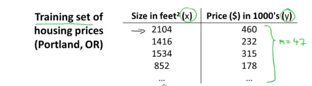
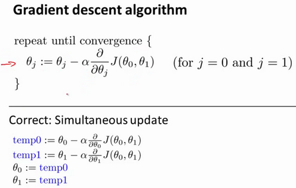

# 1 机器学习概论

机器学习是人工智能的一个领域

## 1.1机器学习定义

Arthur Samuel(1959):在没有明确设置的情况下使计算机具有学习能力的研究领域

Tom Mitchell(1998):计算机程序从经验E中学习，解决某任务T，进行某一性能度量P，通过P测定在T上的表现因经验E而提高

机器学习的分类：1.监督学习 	2.无监督学习

## 1.2监督学习

​	简单定义：训练集中包含”正确答案“

监督学习的典型任务：1.回归 2. 分类

回归：通过一组称为预测器的特征(里程，使用年限，品牌等)来预测一个目标值（如汽车的售价）

分类：通过对数据集分类，预测目标的类别

## 1.3无监督学习

​	简单定义：训练集中不包含“答案”

无监督学习的典型人物：1.聚类

# 2 单变量线性回归

## 2.1 模型描述

m = 训练集的大小

x = 输入变量/特征

y = 输出/目标变量

(x,y) = 一个训练样本

($x^i,y^i$) = 第i个训练样本

​	监督学习算法以一个训练集为输入，输出一个函数h,这个函数把房子的大小x作为输入变量，输出相应房子的预测售价y

​	如何表达h? 一种可能的表达方式为：$h_\theta \left( x \right)=\theta_{0} + \theta_{1}x$，因为只含有一个特征/输入变量，因此这样的问题叫作单变量线性回归问题。其中$\theta_{i}$称为模型参数

## 2.2 代价函数

​	如何选择合适的模型参数？比如$\theta_{0}$选1.5，$\theta_{1}$选0怎么样？

​	我们选择的参数决定了我们得到的直线相对于我们的训练集的准确程度，模型所预测的值与训练集中实际值之间的差距（下图中蓝线所指）就是**建模误差**（**modeling error**）。

​	因此我们的目标就是选出合适的模型参数，让模型误差的平方和能够最小，即代价函数 $J \left( \theta_0, \theta_1 \right) = \frac{1}{2m}\sum\limits_{i=1}^m \left( h_{\theta}(x^{(i)})-y^{(i)} \right)^{2}$最小。

​	注意到$J\left( \theta_0, \theta_1 \right)$是一个二元函数，绘制一个等高线，三个坐标分别为$\theta_{0}$和$\theta_{1}$ 和$J(\theta_{0}, \theta_{1})$：

​	可以看到该三维空间中存在一个点$\left( \theta_0, \theta_1 \right)$使得$J$最小。

​	代价函数也被称作平方误差函数，有时也被称为平方误差代价函数。我们之所以要求出误差的平方和，是因为误差平方代价函数，对于大多数问题，特别是回归问题，都是一个合理的选择。还有其他的代价函数也能很好地发挥作用，但是平方误差代价函数可能是解决回归问题最常用的手段了。

## 	2.3梯度下降

​	梯度下降算法是一个用来求函数最小值的算法，算法思想是：先随机设定一组参数值$\left( {\theta_{0}},{\theta_{1}},......,{\theta_{n}} \right)$,计算代价函数，然后我们寻找一下个能让代价函数**下降的最多**的参数值，重复这个过程就能找到一个局部最小值。

​	如果将代价函数$J$看作一座山，那么这个过程就类似于随机选择山上的一个点，然后从那个点360看一圈，找到下山最快的那个方向，走到下一个点，重复这个过程直到走到局部最低点。根据最开始选择的点的位置，会走到不同的局部最低点，在所有局部最低点中，最低的那个点就是“山底”。

​	批量梯度下降（**batch gradient descent**）算法的公式为：

​	注意：这里必须是同时计算temp0和temp1,计算完temp0后直接赋值给$\theta_0$会导致计算tmp1时出现错误。$\alpha$：学习速率

**解析递归下降算法：**

​	

​	先假设一个更简单的代价函数$J(\theta)$，同时学习速率为正数

​	当初始位置在最小值点右侧时，导数为正数，因此$\theta_0$会变小。

​	同理，在左侧时，导数为负，$\theta_0$会变大。

​	因此更新方程总是能将$\theta_0$往最小值点“移动”，随着算法不断进行，到达最小值点时，由于导数为0，$\theta_0$就会停止"移动"。

**对于学习速率$\alpha$的分析：**

​	如果$\alpha$太小，梯度下降速度会变小，$\theta$到达最小值点的时间就会变长

​	如果$\alpha$太大，$\theta$就有可能会"跨过"最小值点，即无法收敛到最小值点
