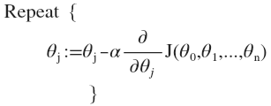

# 1 机器学习概论

机器学习是人工智能的一个领域

## 1.1机器学习定义

Arthur Samuel(1959):在没有明确设置的情况下使计算机具有学习能力的研究领域

Tom Mitchell(1998):计算机程序从经验E中学习，解决某任务T，进行某一性能度量P，通过P测定在T上的表现因经验E而提高

机器学习的分类：1.监督学习 	2.无监督学习

## 1.2监督学习

​	简单定义：训练集中包含”正确答案“

监督学习的典型任务：1.回归 2. 分类

回归：通过一组称为预测器的特征(里程，使用年限，品牌等)来预测一个目标值（如汽车的售价）

分类：通过对数据集分类，预测目标的类别

## 1.3无监督学习

​	简单定义：训练集中不包含“答案”

无监督学习的典型人物：1.聚类

# 2 单变量线性回归

## 2.1 模型描述

m = 训练集的大小

x = 输入变量/特征

y = 输出/目标变量

(x,y) = 一个训练样本

($x^i,y^i$) = 第i个训练样本

​	监督学习算法以一个训练集为输入，输出一个函数h,这个函数把房子的大小x作为输入变量，输出相应房子的预测售价y

​	如何表达h? 一种可能的表达方式为：$h_\theta \left( x \right)=\theta_{0} + \theta_{1}x$，因为只含有一个特征/输入变量，因此这样的问题叫作单变量线性回归问题。其中$\theta_{i}$称为模型参数

## 2.2 代价函数

​	如何选择合适的模型参数？比如$\theta_{0}$选1.5，$\theta_{1}$选0怎么样？

​	我们选择的参数决定了我们得到的直线相对于我们的训练集的准确程度，模型所预测的值与训练集中实际值之间的差距（下图中蓝线所指）就是**建模误差**（**modeling error**）。

​	因此我们的目标就是选出合适的模型参数，让模型误差的平方和能够最小，即代价函数 $J \left( \theta_0, \theta_1 \right) = \frac{1}{2m}\sum\limits_{i=1}^m \left( h_{\theta}(x^{(i)})-y^{(i)} \right)^{2}$最小。

​	注意到$J\left( \theta_0, \theta_1 \right)$是一个二元函数，绘制一个等高线，三个坐标分别为$\theta_{0}$和$\theta_{1}$ 和$J(\theta_{0}, \theta_{1})$：

​	可以看到该三维空间中存在一个点$\left( \theta_0, \theta_1 \right)$使得$J$最小。

​	代价函数也被称作平方误差函数，有时也被称为平方误差代价函数。我们之所以要求出误差的平方和，是因为误差平方代价函数，对于大多数问题，特别是回归问题，都是一个合理的选择。还有其他的代价函数也能很好地发挥作用，但是平方误差代价函数可能是解决回归问题最常用的手段了。

## 	2.3梯度下降算法

​	梯度下降算法是一个用来求函数最小值的算法，算法思想是：先随机设定一组参数值$\left( {\theta_{0}},{\theta_{1}},......,{\theta_{n}} \right)$,计算代价函数，然后我们寻找一下个能让代价函数**下降的最多**的参数值，重复这个过程就能找到一个局部最小值。

​	如果将代价函数$J$看作一座山，那么这个过程就类似于随机选择山上的一个点，然后从那个点360看一圈，找到下山最快的那个方向，走到下一个点，重复这个过程直到走到局部最低点。根据最开始选择的点的位置，会走到不同的局部最低点，在所有局部最低点中，最低的那个点就是“山底”。

​	批量梯度下降（**batch gradient descent**）算法的公式为：

​	注意：这里必须是同时计算temp0和temp1,计算完temp0后直接赋值给$\theta_0$会导致计算tmp1时出现错误。$\alpha$：学习速率

**解析递归下降算法：**

​	

​	先假设一个更简单的代价函数$J(\theta)$，同时学习速率为正数

​	当初始位置在最小值点右侧时，导数为正数，因此$\theta_0$会变小。

​	同理，在左侧时，导数为负，$\theta_0$会变大。

​	因此更新方程总是能将$\theta_0$往最小值点“移动”，随着算法不断进行，到达最小值点时，由于导数为0，$\theta_0$就会停止"移动"。

​	当$\theta$逐渐接近最小值点时，斜率会逐渐降为0，因此导数项会逐渐变小

**对于学习速率$\alpha$的分析：**

​	如果$\alpha$太小，梯度下降速度会变小，$\theta$到达最小值点的时间就会变长

​	如果$\alpha$太大，$\theta$就有可能会"跨过"最小值点，即无法收敛到最小值点

**梯度下降算法的问题**：根据初始点的不同，会得到不同的局部最小点

## 2.4 梯度下降算法在线性回归的应用

梯段下降算法和线性回归算法如下图：

$\frac{\partial }{\partial {{\theta }_{j}}}J({{\theta }_{0}},{{\theta }_{1}})=\frac{\partial }{\partial {{\theta }_{j}}}\frac{1}{2m}{{\sum\limits_{i=1}^{m}{\left( {{h}_{\theta }}({{x}^{(i)}})-{{y}^{(i)}} \right)}}^{2}}$

$j=0$  时：$\frac{\partial }{\partial {{\theta }_{0}}}J({{\theta }_{0}},{{\theta }_{1}})=\frac{1}{m}{{\sum\limits_{i=1}^{m}{\left( {{h}_{\theta }}({{x}^{(i)}})-{{y}^{(i)}} \right)}}}$

$j=1$  时：$\frac{\partial }{\partial {{\theta }_{1}}}J({{\theta }_{0}},{{\theta }_{1}})=\frac{1}{m}\sum\limits_{i=1}^{m}{\left( \left( {{h}_{\theta }}({{x}^{(i)}})-{{y}^{(i)}} \right)\cdot {{x}^{(i)}} \right)}$

则算法改写成：

**Repeat {**

​                ${\theta_{0}}:={\theta_{0}}-a\frac{1}{m}\sum\limits_{i=1}^{m}{ \left({{h}_{\theta }}({{x}^{(i)}})-{{y}^{(i)}} \right)}$

​                ${\theta_{1}}:={\theta_{1}}-a\frac{1}{m}\sum\limits_{i=1}^{m}{\left( \left({{h}_{\theta }}({{x}^{(i)}})-{{y}^{(i)}} \right)\cdot {{x}^{(i)}} \right)}$

​               **}**

特点：梯度下降算法在线性回归问题中，不会出现局部最优解的问题，这是因为代价函数$J$是个凸函数，只有全局最优解

# 3 线性代数

略

# 4多变量线性回归

​	在第三章中讨论了单变量的回归模型，现在讨论具有更多变量的模型，模型中的特征为$\left( {x_{1}},{x_{2}},...,{x_{n}} \right)$。

​	

${x^{\left( i \right)}}$代表第 $i$ 个训练实例，是特征矩阵中的第$i$行，是一个**向量**（**vector**）。

比方说，上图的

${x}^{(2)}\text{=}\begin{bmatrix} 1416\\\ 3\\\ 2\\\ 40 \end{bmatrix}$，

${x}_{j}^{\left( i \right)}$代表特征矩阵中第 $i$ 行的第 $j$ 个特征，也就是第 $i$ 个训练实例的第 $j$ 个特征。

支持多变量的假设 $h$ 表示为：$h_{\theta}\left( x \right)={\theta_{0}}+{\theta_{1}}{x_{1}}+{\theta_{2}}{x_{2}}+...+{\theta_{n}}{x_{n}}$，

为了使得公式能够简化一些，引入$x_{0}=1$，则公式转化为：$h_{\theta} \left( x \right)={\theta_{0}}{x_{0}}+{\theta_{1}}{x_{1}}+{\theta_{2}}{x_{2}}+...+{\theta_{n}}{x_{n}}$

此时模型中的参数是一个$n+1$维的向量，任何一个训练实例也都是$n+1$维的向量，特征矩阵$X$的维度是 $m*(n+1)$。 因此公式可以简化为：$h_{\theta} \left( x \right)={\theta^{T}}X$，其中上标$T$代表矩阵转置。

## 4.1 多元梯度下降

​	在单变量线性回归模型中，我们定义了它的代价函数$J \left( \theta_0, \theta_1 \right) = \frac{1}{2m}\sum\limits_{i=1}^m \left( h_{\theta}(x^{(i)})-y^{(i)} \right)^{2}$。

​	在多变量线性回归模型中，类似的定义多元的代价函数：

$J\left( {\theta_{0}},{\theta_{1}}...{\theta_{n}} \right)=\frac{1}{2m}\sum\limits_{i=1}^{m}{{{\left( h_{\theta} \left({x}^{\left( i \right)} \right)-{y}^{\left( i \right)} \right)}^{2}}}$

​	类似的，多变量线性回归的批量梯度下降算法为：

​	即：

​	当$n>=1$时，
${{\theta }_{0}}:={{\theta }_{0}}-a\frac{1}{m}\sum\limits_{i=1}^{m}{({{h}_{\theta }}({{x}^{(i)}})-{{y}^{(i)}})}x_{0}^{(i)}$

${{\theta }_{1}}:={{\theta }_{1}}-a\frac{1}{m}\sum\limits_{i=1}^{m}{({{h}_{\theta }}({{x}^{(i)}})-{{y}^{(i)}})}x_{1}^{(i)}$

${{\theta }_{2}}:={{\theta }_{2}}-a\frac{1}{m}\sum\limits_{i=1}^{m}{({{h}_{\theta }}({{x}^{(i)}})-{{y}^{(i)}})}x_{2}^{(i)}$

## 4.2 特征缩放

​	当问题具有多个特征时，如果能保证这些特征的取值在相近的范围内，那么梯度下降算法就能更快的收敛

​	比如说，房价问题有两个特征，房屋尺寸($x_1$)和卧室数量($x_2$)，房屋尺寸的取值范围在0-2000,而卧室个数在0-5。此时暂时将$\theta_0$设为0，那么$J(\theta_1,\theta_2)$的等高线将是一个极为狭长的椭圆，如下图，梯度下降算法会来回移动才能到达最低点，因此会花费较多时间才能收敛

 此时使用特征缩放的技巧，

令	$\Large x_1=\frac{size(房屋尺寸)}{2000}$

  	 $\Large x_2 = \frac{卧室数量}{5}$

​	此时$x_1$和$x_2$的取值范围就都是0-1，因此等高线就会变成一个圆，梯度下降算法将会以直线到达最低点，话费较少的时间收敛，如下图

​	更一般的说，通常我们将特征的取值缩放到[-1,1]区间，($x_0$在定义上就等于1)，但其实也不是非得在-1到1之间，相近即可，不用太教条

**均值归一化**：令$x_i=x_i-\mu_i$，此时特征值将具有0的平均值（不对$x_0$进行均值归一化）

​	如房价问题中，$x_1$的取值范围在0-2000，那么平均值$\mu_1=1000$，此时$x_1-\mu_1$为新的$x_1$，同时均值就变成了0。

此时特征放缩的公式变为

$\Large x_1=\frac{房屋面积-1000}{2000}，x_2=\frac{卧室数量-2}{5}$

（分母的2000和5是范围，也就是取值“$最大值 - 最小值$”）

此时，$x_1$和$x_2$的取值范围就变成[-0.5,0.5]

## 4.3 学习率 

- 如何确保梯度下降算法在正常工作？
- 如何确定学习率$\alpha$？

1.如何确保梯度下降算法在正常工作？

​	在梯度下降算法执行时，可以绘制迭代次数与代价函数的图表来预测算法的收敛情况，如下图所示，横坐标是迭代次数，纵坐标是代价函数

​	当代价函数的图像呈现为逐渐增大，或者”反复震荡“的情况是，很可能是因为学习率$\alpha$过大，可以适当降低学习率，但如果太小收敛速度会变得很慢。

2.如何确定学习率$\alpha$？

​	这需要尝试不同的$\alpha$值，通常会选择从0.001开始，三倍增加，如：0.001，0.003，0.01(不选0.009是因为0.01更好看)，0.03.....，1

## 4.4 特征与多项式回归

​	探讨房价预测问题，现在假设特征分别是：房屋宽度$(x_1)$，房屋纵向深度$(x_2)$，如下图。

​	

此时线性回归模型为：

$h_{\theta}\left( x \right)={\theta_{0}}+{\theta_{1}}\times{frontage}+{\theta_{2}}\times{depth}$ 

${x_{1}}=frontage$（临街宽度），${x_{2}}=depth$（纵向深度）

根据几何知识可知，面积=长\*宽 ， 所以另$x=frontage*depth=area$，则模型的参数减少为1个，${h_{\theta}}\left( x \right)={\theta_{0}}+{\theta_{1}}x$。

​	但是线性回归模型并不是用于所有数据，比如下图的数据集，很难用线性回归模型拟合，此时可以用二次方模型：$h_{\theta}\left( x \right)={\theta_{0}}+{\theta_{1}}{x_{1}}+{\theta_{2}}{x_{2}^2}$，但是显然房价不会随着面积增加反而减少，所以考虑三次方模型： $h_{\theta}\left( x \right)={\theta_{0}}+{\theta_{1}}{x_{1}}+{\theta_{2}}{x_{2}^2}+{\theta_{3}}{x_{3}^3}$ 

​	通常我们需要先观察数据然后再决定准备尝试怎样的模型。 另外，我们可以令：

${{x}_{2}}=x_{2}^{2},{{x}_{3}}=x_{3}^{3}$，从而将模型转化为线性回归模型。此时各个特征的取值范围就有了很大的区别，因此需要做好特征放缩。

​	根据函数的图形特征，也可以将模型设为：${{{h}}_{\theta}}(x)={{\theta }_{0}}\text{+}{{\theta }_{1}}(size)+{{\theta }_{2}}\sqrt{size}$，或许效果会更好

